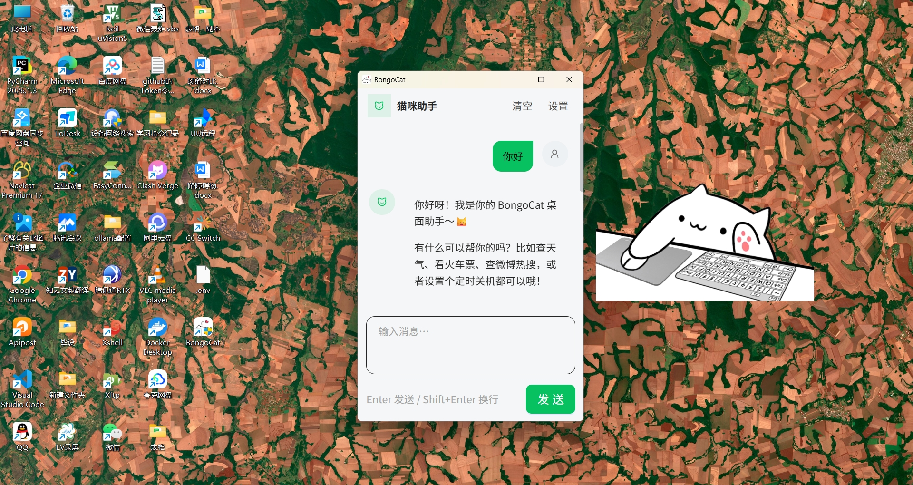
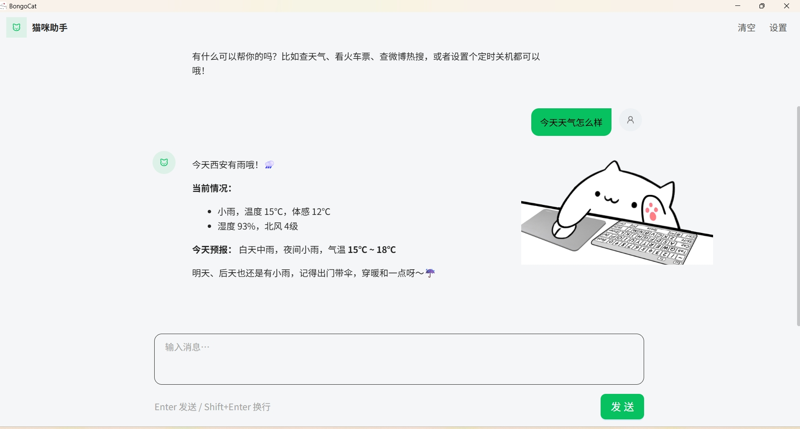
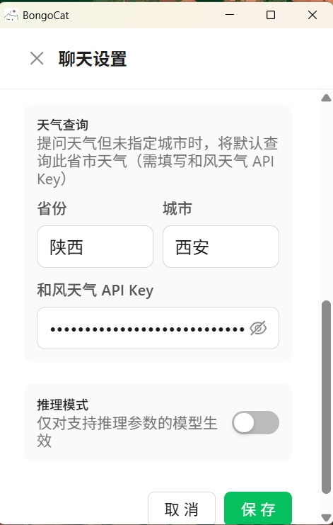
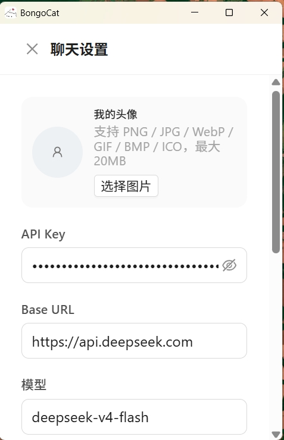

<div align="center">


# BongoCat

**一只住在桌面上的 Live2D 猫咪 —— 跟着你的键盘、鼠标、手柄一起动，还能陪你聊天、查天气、看车票、刷热搜。**

Tauri v2 + Vue 3 + Rust · 支持 Windows / macOS / Linux (x11)

</div>

---

## 目录

- [效果展示](#效果展示)
- [功能特性](#功能特性)
- [AI 技能](#ai-技能)
- [需要配置的 API Key](#需要配置的-api-key)
- [运行步骤](#运行步骤)
- [使用说明](#使用说明)
- [项目结构](#项目结构)
- [技术栈](#技术栈)
- [许可](#许可)

## 效果展示

### 桌面常驻 + 智能助手



猫咪以透明无边框窗口常驻桌面，始终置顶、不占用任务栏。双击猫咪即可唤起右侧的聊天窗口。

### 对话示例：查天气



模型自动调用天气技能，返回实时天气与未来预报，并用口语化的方式给出出行建议。

### 聊天设置：天气与推理模式



可以设置默认省市（问天气没说城市时自动用它）与和风天气 API Key，并单独开关推理模式。

### 聊天设置：模型与 API Key



大模型走 OpenAI 兼容接口，Base URL 和模型名都可改，因此 DeepSeek、通义、Kimi、Ollama 本地模型等都能直接用。

## 功能特性

### 桌面宠物

- 全局捕获键盘 / 鼠标 / 手柄输入，实时驱动 Live2D 模型做出对应动作
- 内置三套模型：标准、键盘、手柄，支持导入自定义模型
- 左键双击猫咪打开聊天窗口，延迟单击则进入拖拽
- 右键拖拽移动窗口，**Shift + 右键拖拽缩放**（10% ~ 500%）
- 透明无边框、始终置顶、跳过任务栏；macOS 下以 NSPanel 嵌入桌面层级
- 托盘图标常驻，右键可打开设置面板

### AI 聊天助手

- 独立聊天窗口，微信风格气泡界面，支持 Markdown 渲染与流式输出
- OpenAI 兼容接口，Base URL / 模型 / 推理开关均可配置
- 聊天记录本地持久化（最多保留 50 条，每次请求携带最近 30 条作为上下文）
- 支持自定义用户头像（PNG / JPG / WebP / GIF / BMP / ICO，最大 20 MB）
- 内置当前日期与默认省市，能正确理解「明天」「下周」这类相对日期
- **每日自动播报**：启动 10 秒后自动弹出聊天窗口，播报今日天气提醒 + 微博热搜精选，每天只执行一次；未配置大模型 API Key 时静默跳过

## AI 技能

聊天助手通过 OpenAI Function Calling 调用以下技能。所有技能均已编译为可执行文件随应用打包分发，**开箱即用，无需自行安装 Python 或额外依赖**。

| 技能 | 函数名 | 说明 | 需要 API Key |
| --- | --- | --- | --- |
| 🌤️ 天气查询 | `query_weather` | 查询指定城市的实时天气与未来 3 天预报；未指定城市时自动使用设置的默认省市 | ✅ 和风天气 |
| 🚄 火车票查询 | `query_ticket` | 查询 12306 直达余票，支持任意日期与车站 | ❌ |
| ⏰ 定时关机 | `schedule_shutdown` | 设置 N 分钟后自动关机，或取消已设置的关机计划（仅 Windows） | ❌ |
| 🔥 微博热搜 | `query_weibo_hotsearch` | 获取微博实时热搜榜前 N 条，无需登录账号 | ❌ |

技能源码存放在 `skills/` 目录，编译后的可执行文件位于 `src-tauri/tools/`，由 Rust 侧 `src-tauri/src/chat/tools.rs` 统一调度。

## 需要配置的 API Key

一共需要两个，其中只有第一个是必填的。

### 1. 大模型 API Key（必填）

聊天功能的必需项，不填则无法对话（每日播报也会自动跳过）。任何 **OpenAI 兼容** 接口都可以，默认对接 DeepSeek：

| 配置项 | 默认值 |
| --- | --- |
| Base URL | `https://api.deepseek.com` |
| 模型 | `deepseek-v4-pro` |

申请地址（以默认值为例）：<https://platform.deepseek.com/api_keys>

换成其他服务商时，只要填对应的 Base URL 与模型名即可，比如：

| 服务商 | Base URL | 模型示例 |
| --- | --- | --- |
| DeepSeek | `https://api.deepseek.com` | `deepseek-v4-pro` |
| 阿里云百炼 | `https://dashscope.aliyuncs.com/compatible-mode/v1` | `qwen-plus` |
| 月之暗面 Kimi | `https://api.moonshot.cn/v1` | `moonshot-v1-8k` |
| 智谱 GLM | `https://open.bigmodel.cn/api/paas/v4` | `glm-4-plus` |
| 本地 Ollama | `http://localhost:11434/v1` | `qwen2.5:7b` |

> ⚠️ 模型需要支持 **Function Calling**，否则技能无法被调用。

### 2. 和风天气 API Key（可选）

只有天气技能需要。不填的话天气查询会失败，但**其他技能和普通聊天都不受影响**。

申请地址：<https://console.qweather.com/> —— 注册后在「项目管理」中创建项目并生成 Key。

同时还需要在聊天设置里填好 **默认省份** 和 **默认城市**：当用户问「今天天气怎么样」而没说城市时，猫会默认查这里。

### 在哪里配置

**方式一：图形界面（推荐）**

双击桌面上的猫咪打开聊天窗口，点右上角 **设置**，填完点保存即可。写入后需要重新打开聊天窗口生效。

**方式二：直接编辑配置文件**

配置保存在**应用配置目录**下的 `.env` 文件中：

| 系统 | 路径 |
| --- | --- |
| Windows | `%APPDATA%\com.ayangweb.BongoCat\.env` |
| macOS | `~/Library/Application Support/com.ayangweb.BongoCat/.env` |
| Linux | `~/.config/com.ayangweb.BongoCat/.env` |

完整配置项：

```dotenv
# BongoCat LLM 配置
LLM_API_KEY=sk-xxxxxxxxxxxxxxxx      # 大模型 API Key（必填）
LLM_BASE_URL=https://api.deepseek.com # OpenAI 兼容接口地址
LLM_MODEL=deepseek-v4-pro             # 模型名
LLM_REASONING=true                    # 推理模式，仅对支持推理参数的模型生效
CHAT_USER_AVATAR=                     # 用户头像文件路径，留空用默认图标
WEATHER_PROVINCE=陕西                  # 默认省份
WEATHER_CITY=西安                      # 默认城市
QWEATHER_API_KEY=xxxxxxxxxxxxxxxx     # 和风天气 API Key
```

## 运行步骤

### 环境要求

| 依赖 | 版本 |
| --- | --- |
| Node.js | 20 或更高 |
| pnpm | 最新稳定版（项目通过 `preinstall` 强制只允许 pnpm） |
| Rust | stable（项目使用 edition 2024，建议 1.85+） |

各平台还需要系统级构建依赖：

- **Windows**：WebView2 运行时（Win11 内置）、MSVC 构建工具链
- **macOS**：Xcode Command Line Tools
- **Linux (x11)**：

  ```bash
  sudo apt-get install -y libwebkit2gtk-4.1-dev libappindicator3-dev librsvg2-dev libudev-dev patchelf xdg-utils
  ```

### 1. 克隆仓库

```bash
git clone https://github.com/cchenglong872-dotcom/BongoCat.git
cd BongoCat
```

### 2. 安装依赖

```bash
pnpm install
```

### 3. 启动开发模式

```bash
pnpm tauri dev
```

这条命令会同时启动 Vite 前端开发服务器和 Rust 后端，并打开猫咪窗口。首次运行需要编译 Rust 依赖，耗时较长。

### 4. 生产构建

```bash
pnpm tauri build
```

产物位于 `src-tauri/target/release/bundle/` 下，按平台生成对应的安装包（Windows 为 NSIS，macOS 为 dmg / app，Linux 为 AppImage / deb / rpm）。

### 其他常用命令

```bash
pnpm dev            # 只启动 Vite 前端，用于纯前端调试
pnpm build          # 只构建前端产物到 dist/
pnpm lint           # ESLint 检查并自动修复
pnpm build:icon     # 重新生成应用图标
```

## 使用说明

| 操作 | 效果 |
| --- | --- |
| 左键**双击**猫咪 | 打开 / 唤起聊天窗口 |
| 左键**按住拖拽** | 移动猫咪位置（按住约 200ms 后进入拖拽） |
| 右键**拖拽** | 移动窗口 |
| 右键**单击** | 弹出右键菜单（含缩放、开机自启、退出等） |
| **Shift + 右键拖拽** | 缩放猫咪（10% ~ 500%） |
| 右键点击托盘图标 | 打开设置面板 |
| 聊天窗口右上角「设置」 | 配置 API Key、模型、头像、默认省市 |
| 聊天窗口右上角「清空」 | 清除本地聊天记录 |

聊天窗口中 `Enter` 发送消息，`Shift + Enter` 换行。

## 项目结构

```
BongoCat/
├── src/                      # Vue 3 前端
│   ├── pages/
│   │   ├── main/             # 猫咪覆盖层（主窗口）
│   │   ├── chat/             # 聊天窗口
│   │   └── preference/       # 设置面板
│   ├── composables/
│   │   ├── useDevice.ts      # 键盘 / 鼠标输入 → Live2D 参数
│   │   ├── useModel.ts       # 模型加载与按键映射
│   │   └── useChat.ts        # 聊天流式渲染
│   ├── stores/               # Pinia：app / cat / model / general / shortcut / chat
│   ├── utils/live2d.ts       # easy-live2d + PixiJS 封装
│   └── locales/              # 五语言翻译
├── src-tauri/                # Rust 后端
│   ├── src/
│   │   ├── chat/             # AI 对话：配置 / 历史 / 流式请求 / 工具调度
│   │   ├── core/             # 输入捕获（rdev、gilrs）与平台初始化
│   │   └── plugins/          # custom-window、admin-status 自定义插件
│   ├── tools/                # 技能可执行文件（随应用打包）
│   └── assets/models/        # 内置 Live2D 模型
├── skills/                   # 技能 Python 源码
└── docs/                     # 文档与截图
```

## 技术栈

**前端**：Vue 3 (Composition API) · TypeScript · Vite 6 · Pinia · Vue Router · Ant Design Vue Next · UnoCSS · PixiJS 8 · easy-live2d · vue-i18n

**后端**：Tauri 2 · Rust · reqwest（流式 SSE）· rdev（键鼠捕获）· gilrs（手柄）

**技能**：Python，经 PyInstaller 打包为独立可执行文件

## 许可

本项目基于 [ayangweb/BongoCat](https://github.com/ayangweb/BongoCat) 二次开发，遵循 [MIT License](LICENSE) 开源协议。

原项目版权归 [ayangweb](https://github.com/ayangweb) 所有，AI 对话与技能系统为本仓库新增内容。
